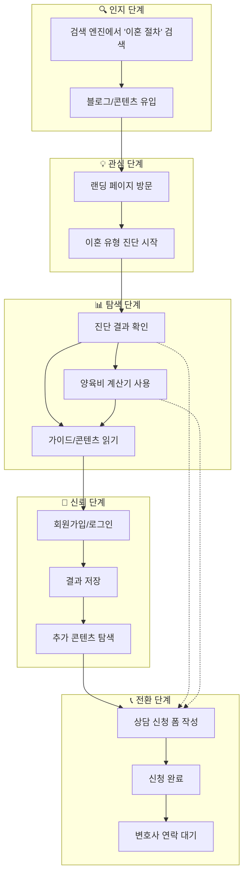
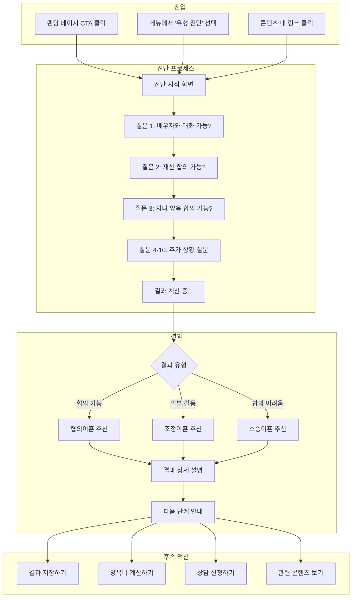
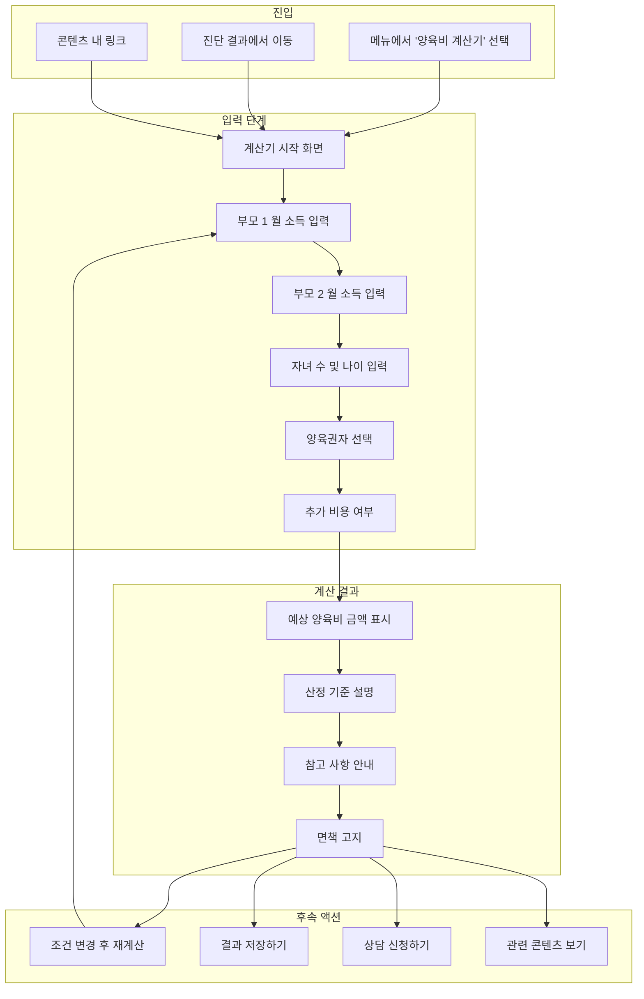
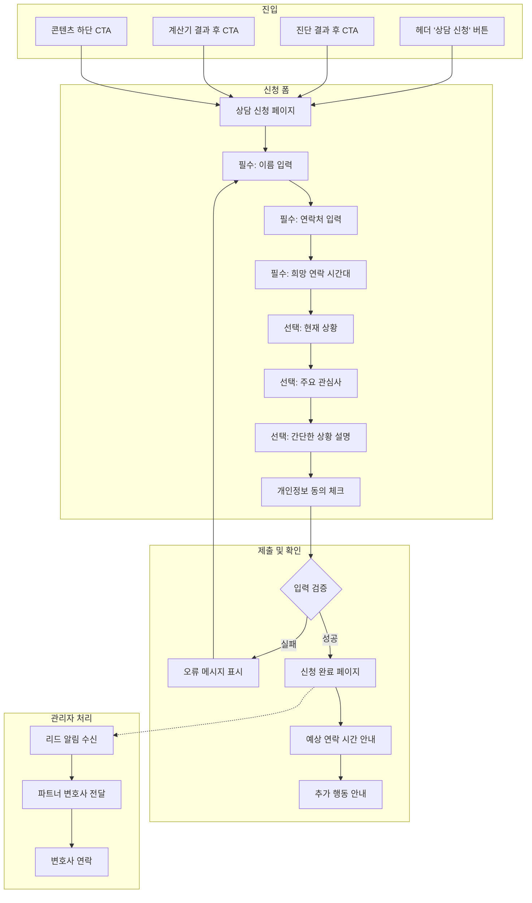
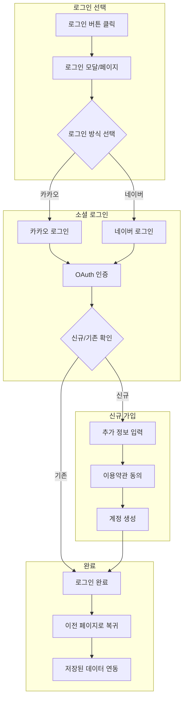
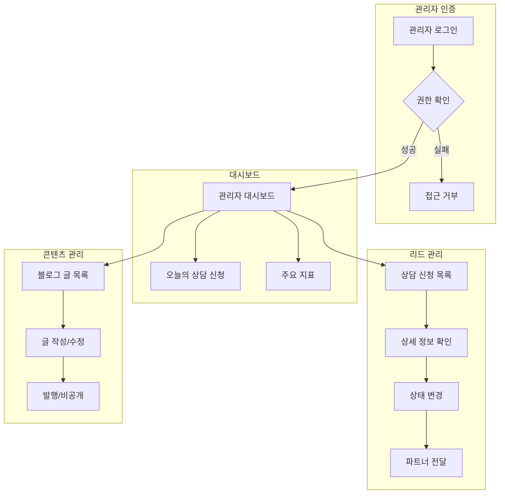

# User Flow (사용자 흐름도)

## 이혼준비 (ihonguide.com) - User Flow Diagrams

---

## 1. 전체 사용자 여정

---

## 2. FEAT-1: 이혼 유형 진단 플로우

---

## 3. FEAT-2: 양육비 계산기 플로우

---

## 4. FEAT-3: 상담 신청 플로우

---

## 5. 인증 플로우

---

## 6. 관리자 플로우

