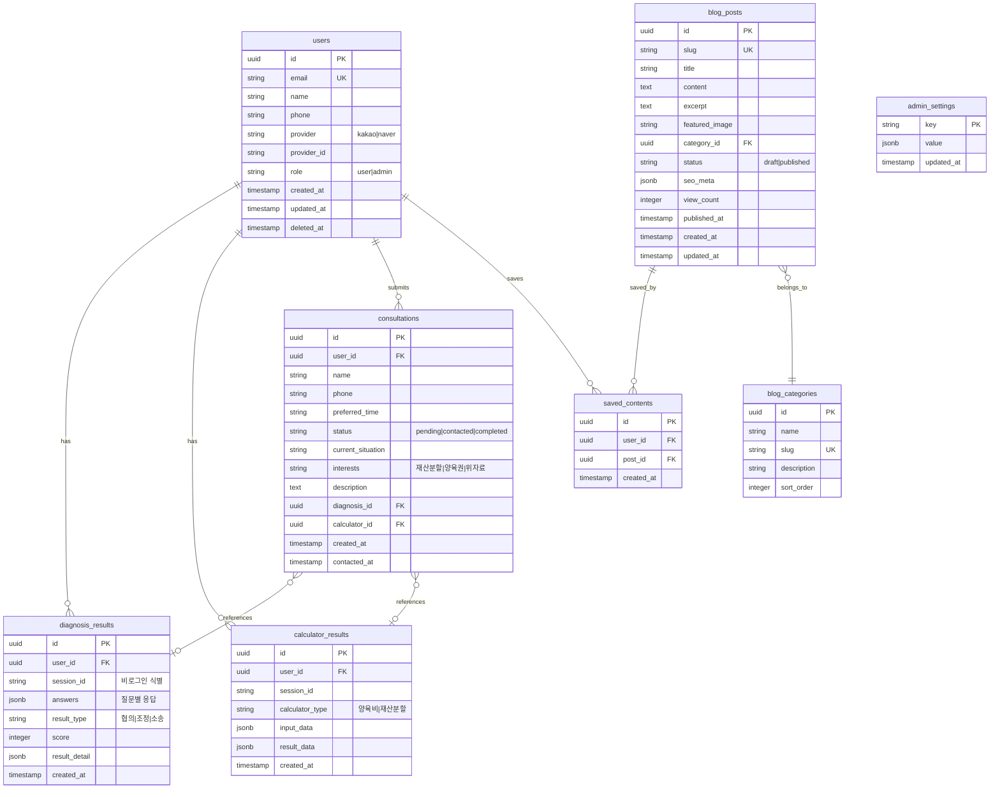

# Database Design (데이터베이스 설계)

## 이혼준비 (ihonguide.com) - Database Schema

---

## 1. ERD (Entity Relationship Diagram)



---

## 2. 테이블 상세 설명

### 2.1 users (사용자)

| 컬럼 | 타입 | 설명 | 제약 |
|------|------|------|------|
| id | UUID | 기본키 | PK, auto-generated |
| email | VARCHAR(255) | 이메일 | UNIQUE, NOT NULL |
| name | VARCHAR(100) | 이름 | - |
| phone | VARCHAR(20) | 전화번호 | - |
| provider | VARCHAR(20) | 소셜 로그인 제공자 | kakao, naver |
| provider_id | VARCHAR(255) | 소셜 ID | - |
| role | VARCHAR(20) | 권한 | DEFAULT 'user' |
| created_at | TIMESTAMP | 생성일 | DEFAULT now() |
| updated_at | TIMESTAMP | 수정일 | - |
| deleted_at | TIMESTAMP | 삭제일 (소프트 삭제) | - |

### 2.2 diagnosis_results (진단 결과) - FEAT-1

| 컬럼 | 타입 | 설명 |
|------|------|------|
| id | UUID | 기본키 |
| user_id | UUID | 사용자 FK (nullable) |
| session_id | VARCHAR(100) | 비로그인 세션 식별 |
| answers | JSONB | 각 질문별 응답 |
| result_type | VARCHAR(20) | 협의/조정/소송 |
| score | INTEGER | 점수 |
| result_detail | JSONB | 상세 분석 결과 |
| created_at | TIMESTAMP | 생성일 |

**answers JSONB 구조 예시:**
```json
{
  "q1": { "questionId": "communication", "answer": "possible", "score": 3 },
  "q2": { "questionId": "property", "answer": "partial", "score": 2 },
  "q3": { "questionId": "children", "answer": "difficult", "score": 1 }
}
```

**result_detail JSONB 구조 예시:**
```json
{
  "recommendation": "조정이혼",
  "reasons": ["재산 분할에 일부 이견", "자녀 양육에 대한 조율 필요"],
  "nextSteps": ["가정법원 조정 신청", "양육비 계산 확인"],
  "estimatedDuration": "3-6개월"
}
```

### 2.3 calculator_results (계산기 결과) - FEAT-2

| 컬럼 | 타입 | 설명 |
|------|------|------|
| id | UUID | 기본키 |
| user_id | UUID | 사용자 FK (nullable) |
| session_id | VARCHAR(100) | 비로그인 세션 식별 |
| calculator_type | VARCHAR(20) | 양육비/재산분할 |
| input_data | JSONB | 입력값 |
| result_data | JSONB | 계산 결과 |
| created_at | TIMESTAMP | 생성일 |

**input_data JSONB 구조 예시 (양육비):**
```json
{
  "parent1Income": 4000000,
  "parent2Income": 3000000,
  "childrenCount": 2,
  "childrenAges": [8, 12],
  "custodian": "parent1",
  "additionalCosts": {
    "education": 500000,
    "medical": 100000
  }
}
```

**result_data JSONB 구조 예시:**
```json
{
  "estimatedAmount": 850000,
  "calculationBasis": "2023년 양육비 산정기준표",
  "breakdown": {
    "baseAmount": 700000,
    "additionalAmount": 150000
  },
  "disclaimer": "이 결과는 참고용이며 실제 금액은 다를 수 있습니다."
}
```

### 2.4 consultations (상담 신청) - FEAT-3

| 컬럼 | 타입 | 설명 |
|------|------|------|
| id | UUID | 기본키 |
| user_id | UUID | 사용자 FK (nullable) |
| name | VARCHAR(100) | 이름 (필수) |
| phone | VARCHAR(20) | 연락처 (필수) |
| preferred_time | VARCHAR(100) | 희망 연락 시간 (필수) |
| status | VARCHAR(20) | 상태 (pending/contacted/completed) |
| current_situation | VARCHAR(50) | 현재 상황 |
| interests | VARCHAR(255) | 관심 분야 (복수 선택) |
| description | TEXT | 상세 설명 |
| diagnosis_id | UUID | 연결된 진단 결과 |
| calculator_id | UUID | 연결된 계산 결과 |
| created_at | TIMESTAMP | 신청일 |
| contacted_at | TIMESTAMP | 연락 완료일 |

**status 값:**
- `pending`: 신청 완료, 연락 대기
- `contacted`: 변호사 연락 완료
- `completed`: 상담 완료

**current_situation 값:**
- `considering`: 고민 중
- `decided`: 결심함
- `in_progress`: 진행 중

**interests 값 (복수 선택 가능, 콤마 구분):**
- `property`: 재산분할
- `custody`: 양육권
- `alimony`: 위자료
- `procedure`: 절차

### 2.5 blog_posts (블로그 글)

| 컬럼 | 타입 | 설명 |
|------|------|------|
| id | UUID | 기본키 |
| slug | VARCHAR(255) | URL 슬러그 (UNIQUE) |
| title | VARCHAR(255) | 제목 |
| content | TEXT | 본문 (HTML/MDX) |
| excerpt | TEXT | 요약 |
| featured_image | VARCHAR(500) | 대표 이미지 URL |
| category_id | UUID | 카테고리 FK |
| status | VARCHAR(20) | 상태 (draft/published) |
| seo_meta | JSONB | SEO 메타 정보 |
| view_count | INTEGER | 조회수 |
| published_at | TIMESTAMP | 발행일 |
| created_at | TIMESTAMP | 생성일 |
| updated_at | TIMESTAMP | 수정일 |

**seo_meta JSONB 구조:**
```json
{
  "title": "이혼 절차 완벽 가이드 2024",
  "description": "협의이혼, 조정이혼, 소송이혼의 절차와 준비물을 상세히 안내합니다.",
  "keywords": ["이혼 절차", "협의이혼", "이혼 서류"],
  "ogImage": "https://..."
}
```

### 2.6 blog_categories (블로그 카테고리)

| 컬럼 | 타입 | 설명 |
|------|------|------|
| id | UUID | 기본키 |
| name | VARCHAR(50) | 카테고리명 |
| slug | VARCHAR(50) | URL 슬러그 |
| description | VARCHAR(255) | 설명 |
| sort_order | INTEGER | 정렬 순서 |

**기본 카테고리:**
- 절차 (procedure)
- 비용 (cost)
- 양육권 (custody)
- 재산분할 (property)
- FAQ (faq)

### 2.7 saved_contents (저장된 콘텐츠)

| 컬럼 | 타입 | 설명 |
|------|------|------|
| id | UUID | 기본키 |
| user_id | UUID | 사용자 FK |
| post_id | UUID | 블로그 글 FK |
| created_at | TIMESTAMP | 저장일 |

### 2.8 admin_settings (관리자 설정)

| 컬럼 | 타입 | 설명 |
|------|------|------|
| key | VARCHAR(100) | 설정 키 (PK) |
| value | JSONB | 설정 값 |
| updated_at | TIMESTAMP | 수정일 |

---

## 3. 인덱스 설계

```sql
-- users
CREATE INDEX idx_users_email ON users(email);
CREATE INDEX idx_users_provider ON users(provider, provider_id);

-- diagnosis_results
CREATE INDEX idx_diagnosis_user ON diagnosis_results(user_id);
CREATE INDEX idx_diagnosis_session ON diagnosis_results(session_id);
CREATE INDEX idx_diagnosis_created ON diagnosis_results(created_at DESC);

-- calculator_results
CREATE INDEX idx_calculator_user ON calculator_results(user_id);
CREATE INDEX idx_calculator_type ON calculator_results(calculator_type);

-- consultations
CREATE INDEX idx_consultations_user ON consultations(user_id);
CREATE INDEX idx_consultations_status ON consultations(status);
CREATE INDEX idx_consultations_created ON consultations(created_at DESC);

-- blog_posts
CREATE INDEX idx_posts_slug ON blog_posts(slug);
CREATE INDEX idx_posts_status_date ON blog_posts(status, published_at DESC);
CREATE INDEX idx_posts_category ON blog_posts(category_id);

-- saved_contents
CREATE INDEX idx_saved_user ON saved_contents(user_id);
CREATE UNIQUE INDEX idx_saved_unique ON saved_contents(user_id, post_id);
```

---

## 4. RLS (Row Level Security) 정책

```sql
-- users: 본인 데이터만 접근
ALTER TABLE users ENABLE ROW LEVEL SECURITY;

CREATE POLICY "Users can view own data" ON users
    FOR SELECT USING (auth.uid() = id);

CREATE POLICY "Users can update own data" ON users
    FOR UPDATE USING (auth.uid() = id);

-- diagnosis_results: 본인 결과만 접근 (비로그인도 세션으로 허용)
ALTER TABLE diagnosis_results ENABLE ROW LEVEL SECURITY;

CREATE POLICY "Users can view own diagnosis" ON diagnosis_results
    FOR SELECT USING (auth.uid() = user_id OR user_id IS NULL);

CREATE POLICY "Users can insert diagnosis" ON diagnosis_results
    FOR INSERT WITH CHECK (true);

-- calculator_results: 본인 결과만 접근
ALTER TABLE calculator_results ENABLE ROW LEVEL SECURITY;

CREATE POLICY "Users can view own calculations" ON calculator_results
    FOR SELECT USING (auth.uid() = user_id OR user_id IS NULL);

CREATE POLICY "Users can insert calculations" ON calculator_results
    FOR INSERT WITH CHECK (true);

-- consultations: 본인 신청만 조회, 누구나 신청 가능
ALTER TABLE consultations ENABLE ROW LEVEL SECURITY;

CREATE POLICY "Users can view own consultations" ON consultations
    FOR SELECT USING (auth.uid() = user_id);

CREATE POLICY "Anyone can insert consultations" ON consultations
    FOR INSERT WITH CHECK (true);

-- blog_posts: 공개 읽기
ALTER TABLE blog_posts ENABLE ROW LEVEL SECURITY;

CREATE POLICY "Published posts are viewable" ON blog_posts
    FOR SELECT USING (status = 'published');

-- blog_categories: 공개 읽기
ALTER TABLE blog_categories ENABLE ROW LEVEL SECURITY;

CREATE POLICY "Categories are viewable" ON blog_categories
    FOR SELECT USING (true);

-- saved_contents: 본인 저장만
ALTER TABLE saved_contents ENABLE ROW LEVEL SECURITY;

CREATE POLICY "Users can manage own saves" ON saved_contents
    FOR ALL USING (auth.uid() = user_id);
```

---

## 5. 초기 데이터

### 5.1 블로그 카테고리

```sql
INSERT INTO blog_categories (id, name, slug, description, sort_order) VALUES
    (gen_random_uuid(), '절차', 'procedure', '이혼 절차 관련 가이드', 1),
    (gen_random_uuid(), '비용', 'cost', '이혼 비용 관련 정보', 2),
    (gen_random_uuid(), '양육권', 'custody', '양육권 관련 정보', 3),
    (gen_random_uuid(), '재산분할', 'property', '재산분할 관련 정보', 4),
    (gen_random_uuid(), 'FAQ', 'faq', '자주 묻는 질문', 5);
```

### 5.2 관리자 설정

```sql
INSERT INTO admin_settings (key, value, updated_at) VALUES
    ('site_name', '"이혼준비"', now()),
    ('contact_email', '"contact@ihonguide.com"', now()),
    ('expected_response_time', '"영업일 기준 1-2일 내"', now());
```
