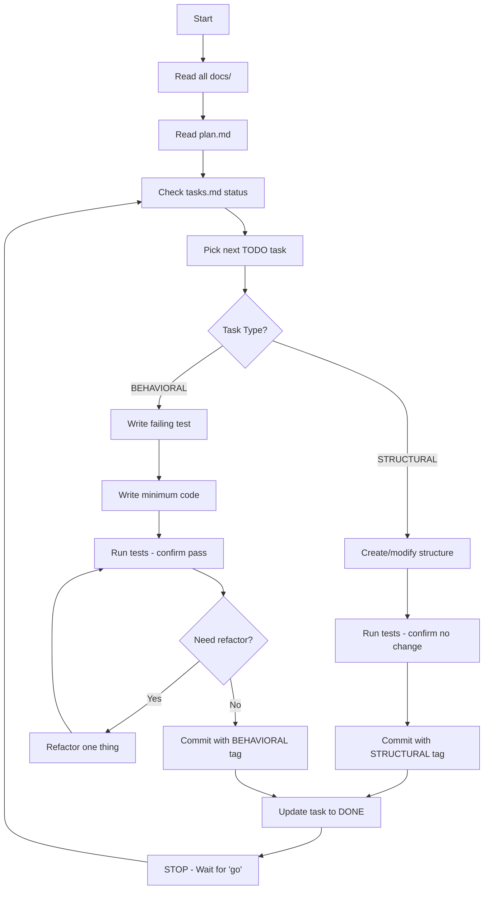

# Development Plan (개발 계획서)

## 이혼준비 (ihonguide.com) - Project Constitution

이 문서는 프로젝트의 **최상위 실행 규칙(Constitution)**입니다.
모든 개발 행위는 이 문서의 규칙을 따라야 합니다.

---

## 1. Development Methodology

### 1.1 TDD (Test-Driven Development)

Kent Beck의 TDD 원칙을 엄격히 따릅니다.

```
Red → Green → Refactor
```

1. **Red**: 실패하는 테스트를 먼저 작성
2. **Green**: 테스트를 통과하는 최소한의 코드 작성
3. **Refactor**: 테스트가 통과하는 상태에서만 리팩토링

### 1.2 Tidy First

Kent Beck의 Tidy First 원칙을 따릅니다.

모든 변경사항은 두 가지 유형으로 분류됩니다:

| 유형 | 설명 | 예시 |
|------|------|------|
| **STRUCTURAL** | 동작 변경 없이 구조만 변경 | 리네이밍, 메서드 추출, 코드 이동, 타입 추가 |
| **BEHAVIORAL** | 실제 기능 추가/수정 | 새 기능, 버그 수정, 로직 변경 |

**핵심 규칙:**
- 구조적 변경과 동작적 변경을 **절대 같은 커밋에 섞지 않음**
- 둘 다 필요하면 **구조적 변경을 먼저** 수행
- 구조적 변경 전후로 테스트를 실행하여 **동작이 변하지 않았음을 확인**

---

## 2. Execution Rules

### 2.1 Documentation First

코드나 테스트를 작성하기 전에 반드시:

1. `/docs` 폴더의 모든 `.md` 파일을 읽고 이해
2. 이 `plan.md` 파일을 읽고 이해
3. `tasks.md`의 현재 상태 확인

### 2.2 One Task at a Time

- 한 번에 하나의 Task만 진행
- Task 완료 후 즉시 상태를 `DONE`으로 업데이트
- **작업 즉시 중단**하고 사용자의 `"go"` 입력 대기

### 2.3 Test First, Always

- 모든 BEHAVIORAL Task는 실패하는 테스트로 시작
- 테스트 없이 코드 작성 금지
- 테스트 이름은 동작을 명확히 표현

```typescript
// Good
it('shouldReturnConsultationTypeWhenScoreAbove25', () => {})

// Bad
it('test1', () => {})
```

### 2.4 Minimum Viable Code

- 테스트를 통과하는 **최소한의 코드만** 작성
- "나중에 필요할 것 같은" 코드 작성 금지
- 현재 테스트가 요구하는 것만 구현

### 2.5 Refactor in Green

- 리팩토링은 **오직 Green 상태에서만**
- 리팩토링 중 새 기능 추가 금지
- 리팩토링 후 모든 테스트 재실행

---

## 3. Commit Discipline

### 3.1 Commit Conditions

커밋은 다음 조건을 **모두** 충족할 때만:

- [ ] 모든 테스트 통과
- [ ] 컴파일러/린터 경고 없음
- [ ] 하나의 논리적 작업 단위만 포함
- [ ] STRUCTURAL 또는 BEHAVIORAL 명시

### 3.2 Commit Message Format

```
[TYPE] 간결한 설명

TYPE:
- STRUCTURAL: 구조적 변경
- BEHAVIORAL: 동작적 변경
- FIX: 버그 수정
- TEST: 테스트 추가/수정
- DOCS: 문서 수정
```

**예시:**
```
[STRUCTURAL] Extract calculateChildSupport from CalculatorService
[BEHAVIORAL] Add consultation form phone validation
[FIX] Resolve null reference in diagnosis result display
[TEST] Add unit tests for child support edge cases
```

### 3.3 Commit Frequency

- **작고 빈번한 커밋** 선호
- 하나의 Task당 1-3개의 커밋이 적절
- 대규모 커밋 지양

---

## 4. Code Quality Standards

### 4.1 Naming

```typescript
// 변수: camelCase, 의미있는 이름
const userDiagnosisResult = ...

// 함수: camelCase, 동사로 시작
function calculateChildSupport() {}

// 컴포넌트: PascalCase
function DiagnosisResultCard() {}

// 상수: SCREAMING_SNAKE_CASE
const MAX_QUESTION_COUNT = 10
```

### 4.2 Functions

- 단일 책임 원칙 준수
- 10줄 이하 권장
- 매개변수 3개 이하
- 부수 효과 최소화

### 4.3 Duplication

- 중복 코드 **적극적으로 제거**
- 3회 이상 반복되면 추상화 고려
- 단, 성급한 추상화 경계

---

## 5. Testing Standards

### 5.1 Test Structure

```typescript
describe('FeatureName', () => {
  describe('functionName', () => {
    it('shouldDoSomethingWhenCondition', () => {
      // Arrange
      const input = ...

      // Act
      const result = functionName(input)

      // Assert
      expect(result).toBe(expected)
    })
  })
})
```

### 5.2 Test Coverage

| 영역 | 최소 커버리지 |
|------|---------------|
| 비즈니스 로직 | 90% |
| API Routes | 80% |
| UI Components | 60% |
| 전체 | 70% |

### 5.3 Test Types

```
단위 테스트 (Unit)      → 개별 함수/컴포넌트
통합 테스트 (Integration) → API + DB
E2E 테스트 (End-to-End)  → 전체 사용자 흐름
```

---

## 6. Error Handling

### 6.1 API Errors

```typescript
// 표준 에러 응답 형식
interface ApiError {
  code: string
  message: string
  details?: Record<string, unknown>
}

// 예시
return NextResponse.json(
  { code: 'VALIDATION_ERROR', message: '필수 항목이 누락되었습니다.' },
  { status: 400 }
)
```

### 6.2 Client Errors

- 사용자에게 친절한 메시지 표시
- 기술적 에러는 콘솔에만 로깅
- 재시도 가능한 액션 제공

---

## 7. Security Checklist

모든 Task 완료 전 확인:

- [ ] SQL Injection 방지 (Supabase 파라미터 바인딩 사용)
- [ ] XSS 방지 (사용자 입력 이스케이프)
- [ ] CSRF 보호 확인
- [ ] 민감 정보 하드코딩 없음
- [ ] 환경 변수로 시크릿 관리
- [ ] RLS 정책 적용 확인

---

## 8. Performance Guidelines

### 8.1 이미지

- `next/image` 사용 필수
- WebP 포맷 우선
- 적절한 width/height 지정

### 8.2 번들 크기

- Dynamic import로 코드 스플리팅
- 불필요한 의존성 제거
- Tree shaking 확인

### 8.3 렌더링

- SSG/ISR 우선 고려
- Client Component 최소화
- Suspense로 로딩 처리

---

## 9. Document Hierarchy

문서 간 충돌 시 우선순위:

```
1. plan.md (최우선 - 실행 규칙)
2. tasks.md (개발 큐)
3. 01-PRD.md (제품 요구사항)
4. 02-TRD.md (기술 요구사항)
5. 나머지 docs/ 문서
```

---

## 10. Agent Workflow Summary



---

## 11. Quick Reference

### 실행 전 체크리스트

```
□ docs/ 모든 문서 읽음
□ plan.md 규칙 이해함
□ tasks.md에서 다음 Task 확인함
□ Task가 STRUCTURAL인지 BEHAVIORAL인지 확인함
```

### Task 완료 체크리스트

```
□ 모든 테스트 통과
□ 린터 경고 없음
□ 커밋 메시지에 타입 명시
□ tasks.md 상태 DONE으로 업데이트
□ 작업 중단 - 'go' 대기
```

### 금지 사항

```
✗ 테스트 없이 코드 작성
✗ STRUCTURAL과 BEHAVIORAL 혼합 커밋
✗ 사용자 확인 없이 다음 Task 진행
✗ "나중에 필요할" 코드 미리 작성
✗ Green 상태가 아닐 때 리팩토링
```
